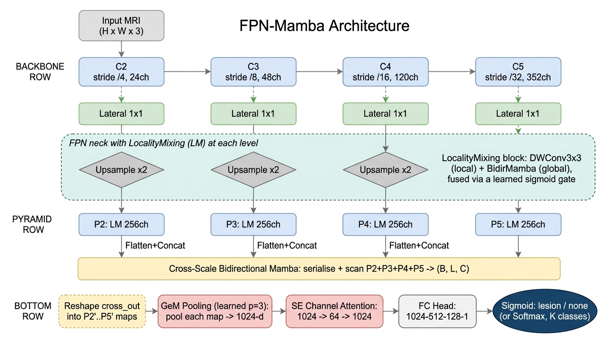
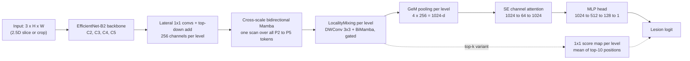

# FPN-Mamba: Multi-Scale State Space Models for Brain MRI Lesion Classification

FPN-Mamba combines a **Feature Pyramid Network (FPN)** with **bidirectional Mamba state space models** to classify lesions in brain MRI. We compare it against **InceptentionNet** (Fang et al., 2025), a CNN with self-attention, and against standard CNN baselines. All models share the same data, folds, and training protocol.

This repository holds the model code, training and evaluation scripts, and the raw results for both experiments. It is a course project for Computer Vision at Carnegie Mellon University (Spring 2026).

## Highlights

| Finding | Evidence |
| :--- | :--- |
| On full-slice metastasis screening, FPN-Mamba beats InceptentionNet on AUC | 0.832 vs 0.758, paired t-test p = 0.035 (3 folds) |
| ResNet-50 is the strongest full-slice model on AUC | 0.868, significantly above FPN-Mamba (p = 0.013) |
| On lesion-centered crops, every EfficientNet-based model reaches AUC 0.978 or higher | InceptentionNet reaches 0.907, with much higher fold-to-fold variance |
| FPN-Mamba scales better with resolution than self-attention | Step time grows 3.0x from 256px to 512px, vs 8.6x for InceptentionNet |
| The fused `mamba-ssm` CUDA kernel makes training practical | About 15x faster per fold than a pure PyTorch selective scan |

All comparisons use 3 folds and a single seed, so treat them as exploratory. See [Limitations](#limitations).

## Contents

1. [Motivation](#motivation)
2. [Architecture](#architecture)
3. [Models compared](#models-compared)
4. [Data and tasks](#data-and-tasks)
5. [Training and evaluation protocol](#training-and-evaluation-protocol)
6. [Results](#results)
7. [Repository layout](#repository-layout)
8. [Setup](#setup)
9. [Reproducing the results](#reproducing-the-results)
10. [Known gaps in this snapshot](#known-gaps-in-this-snapshot)
11. [Limitations](#limitations)
12. [Project history](#project-history)
13. [References](#references)
14. [Authors](#authors)

## Motivation

InceptentionNet applies self-attention to a **single, heavily downsampled feature map**. This causes two problems for lesion detection:

1. **Small lesions get lost.** A lesion a few pixels wide can be averaged away before attention ever sees it. Fang et al.'s own error analysis names small, weakly contrasted, and atypically located tumors as the main source of false negatives.
2. **Attention cost grows with the square of the token count.** Running attention at fine resolution quickly becomes too expensive.

FPN-Mamba addresses both:

- **The pyramid keeps multiple scales.** Every level from stride 4 (fine) to stride 32 (coarse) reaches the classifier, so small-lesion evidence is not structurally discarded.
- **Mamba scans run in linear time, O(L).** Bidirectional selective scans replace self-attention, so global context is affordable even at the finest pyramid level.

## Architecture



> **Note on ordering.** The figure shows the Phase 1 design, where LocalityMixing runs at each level *before* the cross-scale Mamba scan. The current code in [code/scripts/kernel_fpn_mamba.py](code/scripts/kernel_fpn_mamba.py) reverses this. The cross-scale scan is now the primary fusion step and LocalityMixing refines each level afterward. This matches the MambaFPN ablations (Liang et al., 2026), where the joint cross-scale fusion drives most of the gain. The diagram below shows the forward pass as currently implemented.



### Components

| Stage | What it does | Details |
| :--- | :--- | :--- |
| **Backbone** | EfficientNet-B2 (ImageNet weights, via `timm`) | Last four feature levels C2 to C5 at strides 4, 8, 16, 32 with 24, 48, 120, 352 channels. Stem and first two stages are frozen. |
| **FPN laterals and top-down path** | Projects each level to 256 channels, then adds the upsampled deeper level to each shallower one | Nearest-neighbor upsampling, as in Lin et al. (2017) |
| **Cross-scale bidirectional Mamba** | Flattens P2 to P5, concatenates them into one token sequence, and runs a forward and a reversed Mamba scan over it. The two outputs are summed, normalized with LayerNorm, and split back into per-level maps. | Replaces the usual 3x3 FPN smoothing conv. Fine-scale evidence can inform coarse-scale features and the reverse. |
| **LocalityMixing** | Per level: a depthwise 3x3 conv (local branch) and a bidirectional Mamba over the H x W tokens (global branch), blended by a learned per-position sigmoid gate: `w * local + (1 - w) * global` | Adapted from MambaFPN |
| **GeM pooling** | Generalized mean pooling on each level, learned exponent initialized at p = 3 | Weights high-activation positions over background tissue |
| **SE attention** | Squeeze-and-excitation over the 1024 concatenated channels (reduction 16) | Re-weights which scales and channels matter |
| **Head** | Linear 1024 to 512, LayerNorm, GELU, Dropout 0.3, Linear 512 to 128, GELU, Dropout 0.15, Linear 128 to 1 | Binary logit, trained with `BCEWithLogitsLoss` |
| **Top-k head (optional)** | Replaces pooling + MLP with a shared 1x1 conv that scores every position on every level. The logit is the mean of the 10 highest scores. | Lets a few strong positions decide, instead of averaging a tiny lesion into the whole slice. Supports an optional Dice auxiliary loss on the score maps. |

The full model has **12.7M parameters**. InceptentionNet has 1.08M.

## Models compared

**Baselines**

| Name | Description | Code |
| :--- | :--- | :--- |
| `inceptentionnet` | Our re-implementation of Fang et al. (2025). 3x3 stem (64 ch), a modified Inception block (1x1, 3x3, 5x5, and strided 3x3 branches, 64 ch each, concatenated and downsampled), 4-head self-attention over all positions, average pooling, MLP 256 to 128 to 64 to 1. | [code/src/models/inceptentionnet.py](code/src/models/inceptentionnet.py) |
| `resnet50` | ImageNet ResNet-50, fine-tuned | `src/models/timm_classifier.py` (not in this snapshot) |
| `efficientnet_only` | The EfficientNet-B2 backbone with a classifier head and no FPN | `src/models/ablation.py` (not in this snapshot) |

**Ablation ladder** (each rung adds one component)

| Variant | FPN fusion | LocalityMixing | Pooling | SE | Head |
| :--- | :--- | :---: | :--- | :---: | :--- |
| `fpn_standard` | 3x3 conv | no | | | MLP |
| `fpn_locality` | 3x3 conv | yes | Average | no | MLP |
| `fpn_cross_mamba` | Cross-scale Mamba | yes | Average | no | MLP |
| `fpn_mamba_full` | Cross-scale Mamba | yes | GeM | yes | MLP |
| `fpn_mamba_full_topk` | Cross-scale Mamba | yes | none | no | Top-10 score |

The four Mamba variants are defined in `ABLATION_VARIANTS` in [code/scripts/kernel_fpn_mamba.py](code/scripts/kernel_fpn_mamba.py). `fpn_standard` is defined in `src/models/ablation.py`, which is not in this snapshot, so its pooling and SE settings are not recorded here.

## Data and tasks

Experiments use the **UCSF Brain Metastases Stereotactic Radiosurgery (UCSF-BMSR)** MRI dataset (Rudie et al., 2024). The task is binary: does the input contain a metastasis or not? Two input setups are evaluated.

| Setup | Input | Size | Channels | Held-out samples (3 folds) |
| :--- | :--- | :--- | :--- | :--- |
| **Full-slice screening** | Whole axial slice at a canonical field of view | 256 x 256 | 3 adjacent post-contrast T1 slices (2.5D) | 7,511 slices (4,340 positive) |
| **Crop-based, per-modality** | 100 mm lesion-centered crop | 128 x 128 | Center slice of post-contrast T1, subtraction, and FLAIR | 4,879 crops (2,886 positive) |

Each positive sample also carries a lesion size bin (`tiny`, `small`, `medium`, `large`), which we use for size-stratified recall. Tiny lesions are the clinically important failure case.

The image data is **not included** in this repository. The runners expect the extraction pipeline outputs:

- Full-slice: `pipeline_output_fullslice_256/manifest_with_folds.csv` and `pipeline_output_fullslice_256/crops/`
- Crop-based: `pipeline_output/manifest_with_folds.csv` and `pipeline_output/crops/` (each `.npz` stores `t1post`, `subtraction`, `flair`, and optionally `mask`)

## Training and evaluation protocol

All models are trained under the same protocol:

- **Cross-validation:** 3 folds from `manifest_with_folds.csv`. For each fold, the other two folds form the training pool.
- **Calibration split:** 15% of the training pool is held out as a calibration set, **grouped by patient** so that no patient appears in both sets.
- **Preprocessing:** per-channel min-max scaling to [0, 1], bilinear resize, ImageNet normalization.
- **Augmentation:** random horizontal and vertical flips.
- **Class balance:** `WeightedRandomSampler` with inverse class frequency.
- **Optimization:** AdamW (lr 1e-4, weight decay 1e-4), batch size 4, up to 15 epochs, early stopping with patience 8.
- **Checkpoint selection:** the epoch with the best calibration-set AUC.
- **Threshold:** tuned on the calibration set within [0.05, 0.95], then applied unchanged to the held-out fold.
- **Metrics:** AUC, sensitivity (recall), specificity, F1, accuracy, and recall per lesion size bin.
- **Statistics:** paired t-tests across folds (n = 3), with no correction for multiple comparisons.

> The main-venv pipeline ([ucsf_bmsr_pipeline.py](code/src/training/ucsf_bmsr_pipeline.py)) uses `CosineAnnealingWarmRestarts(T_0=5)`. The kernel-venv pipeline ([kernel_ucsf_pipeline.py](code/scripts/kernel_ucsf_pipeline.py)) uses a constant learning rate. This means the Mamba variants and the non-Mamba models do not have identical LR schedules.

## Results

Raw per-fold JSON files, summary CSVs, and benchmark logs are in [results/](results/).

### Full-slice screening (256px, 3 folds, seed 42)

Values are mean ± std across folds. "Tiny recall" is recall on tiny lesions, pooled across folds and weighted by sample count.

| Model | AUC | Sensitivity | Specificity | F1 | Tiny recall |
| :--- | :---: | :---: | :---: | :---: | :---: |
| InceptentionNet | 0.758 ± 0.030 | **0.902** ± 0.037 | 0.512 ± 0.070 | 0.799 ± 0.007 | **0.903** |
| ResNet-50 | **0.868** ± 0.015 | 0.751 ± 0.091 | **0.773** ± 0.116 | 0.783 ± 0.029 | 0.660 |
| EfficientNet-B2 only | 0.812 ± 0.007 | 0.747 ± 0.123 | 0.703 ± 0.088 | 0.757 ± 0.058 | 0.701 |
| FPN (standard) | 0.824 ± 0.015 | 0.792 ± 0.077 | 0.664 ± 0.066 | 0.776 ± 0.034 | 0.739 |
| FPN + LocalityMixing | 0.828 ± 0.028 | 0.870 ± 0.013 | 0.586 ± 0.047 | **0.801** ± 0.015 | 0.841 |
| FPN + cross-scale Mamba | 0.835 ± 0.007 | 0.848 ± 0.078 | 0.622 ± 0.096 | 0.797 ± 0.021 | 0.819 |
| **FPN-Mamba (full)** | 0.832 ± 0.009 | 0.735 ± 0.101 | 0.743 ± 0.107 | 0.763 ± 0.034 | 0.691 |

What this shows:

- **FPN-Mamba vs InceptentionNet:** FPN-Mamba has higher AUC (p = 0.035). This is the only statistically significant result in FPN-Mamba's favor on this task.
- **InceptentionNet's high sensitivity comes from calling most slices positive.** Its specificity is 0.512, and it has the lowest AUC of any model.
- **ResNet-50 has the best AUC** and beats FPN-Mamba significantly (p = 0.013).
- **The FPN variants are within about 0.01 AUC of each other.** Adding GeM + SE on top of `fpn_cross_mamba` mostly moves the operating point: specificity rises from 0.622 to 0.743 (p = 0.003), and sensitivity drops from 0.848 to 0.735 (p = 0.025).

Full table: [paper_final_significance.csv](results/full_slice_screening/paper_final_significance.csv). Size-stratified recall: [paper_final_size_stratified.csv](results/full_slice_screening/paper_final_size_stratified.csv).

### Crop-based, per-modality (128px, 3 folds, seed 42)

| Model | AUC | Sensitivity | Specificity | Tiny recall | Small recall |
| :--- | :---: | :---: | :---: | :---: | :---: |
| InceptentionNet | 0.907 ± 0.081 | 0.836 ± 0.034 | 0.844 ± 0.139 | 0.784 ± 0.036 | 0.897 ± 0.061 |
| EfficientNet-B2 only | 0.978 ± 0.003 | 0.906 ± 0.020 | 0.971 ± 0.012 | 0.856 ± 0.039 | 0.964 ± 0.009 |
| FPN + LocalityMixing | **0.983** ± 0.002 | 0.917 ± 0.019 | 0.970 ± 0.005 | **0.877** ± 0.032 | 0.973 ± 0.012 |
| FPN + cross-scale Mamba | 0.981 ± 0.004 | 0.897 ± 0.019 | **0.980** ± 0.002 | 0.848 ± 0.041 | 0.964 ± 0.010 |
| **FPN-Mamba (full)** | 0.982 ± 0.003 | 0.911 ± 0.004 | 0.974 ± 0.004 | 0.866 ± 0.003 | 0.974 ± 0.008 |
| FPN-Mamba (top-k head) | 0.982 ± 0.002 | **0.920** ± 0.013 | 0.970 ± 0.014 | 0.876 ± 0.029 | **0.977** ± 0.008 |

What this shows:

- **Crops make the task much easier.** Every EfficientNet-based model reaches an AUC of 0.978 or higher.
- **FPN-Mamba beats InceptentionNet on all five metrics, but no difference reaches p < 0.05.** The closest is tiny-lesion recall (0.866 vs 0.784, p = 0.077). InceptentionNet's large fold variance (AUC std 0.081) limits statistical power.
- **FPN-Mamba is the most consistent model across folds.** It has the smallest standard deviations on sensitivity and tiny recall.
- **The ablation rungs are tightly clustered.** Of the 75 pairwise tests, the few with p < 0.05 are not corrected for multiple comparisons and should not be read as confirmed differences.

Full table: [crop_permodality_significance.csv](results/crop_permodality/crop_permodality_significance.csv).

### Efficiency

These numbers are for a single training step (forward, backward, and an AdamW update) at batch size 4 on one A100, averaged over 20 iterations after 5 warmup iterations, with synthetic inputs.

| | InceptentionNet | FPN-Mamba (full) |
| :--- | :---: | :---: |
| Parameters | 1.08M | 12.72M |
| 256px: time per step | **28.1 ms** | 51.8 ms |
| 256px: throughput | **142.2 samples/s** | 77.1 samples/s |
| 256px: peak memory | **0.95 GB** | 2.39 GB |
| 512px: time per step | 242.0 ms | **153.9 ms** |
| 512px: throughput | 16.5 samples/s | **26.0 samples/s** |
| 512px: peak memory | **3.68 GB** | 8.99 GB |
| Step time growth, 256px to 512px | 8.6x | **3.0x** |

InceptentionNet is cheaper at 256px. At 512px, its quadratic attention (16,384 tokens) makes it 1.6x slower per step than FPN-Mamba, even though it has 12x fewer parameters. At 512px, InceptentionNet only fits in memory because attention is called with `need_weights=False`, which enables PyTorch's memory-efficient kernel. Without it, training ran out of memory at about 32 GB.

**Fused kernel vs pure PyTorch scan:** on full-slice 256px training, `fpn_mamba_full` averaged about 16,400 s per fold with a chunked pure-PyTorch selective scan and about 1,080 s per fold with the `mamba-ssm` CUDA kernel. That is roughly a 15x speedup.

Raw logs: [results/efficiency/](results/efficiency/).

## Repository layout

```text
.
├── README.md
├── architecture.jpg                         FPN-Mamba architecture figure
├── code/
│   ├── src/
│   │   ├── models/inceptentionnet.py        InceptentionNet re-implementation
│   │   └── training/ucsf_bmsr_pipeline.py   Dataset + train_one_fold for non-Mamba models (main venv)
│   └── scripts/
│       ├── kernel_fpn_mamba.py              FPNMambaClassifier + ABLATION_VARIANTS (mamba-ssm kernel)
│       ├── kernel_ucsf_pipeline.py          Dataset + train_one_fold for Mamba variants (kernel venv)
│       ├── run_ablation_fold.py             Full-slice runner, one (variant, fold), main venv
│       ├── run_kernel_ablation_fold.py      Full-slice runner, one (variant, fold), kernel venv
│       ├── run_crop_fold.py                 Crop-based runner, main venv
│       ├── run_crop_kernel_fold.py          Crop-based runner, kernel venv
│       ├── run_crop_main_parallel.sbatch    Slurm: 3 folds in parallel on 3 GPUs (main venv)
│       ├── run_crop_kernel_parallel.sbatch  Slurm: 3 folds in parallel on 3 GPUs (kernel venv)
│       ├── consolidate_final_results.py     Full-slice summary tables + paired t-tests
│       ├── crop_permodality_significance.py Crop-based summary tables + paired t-tests
│       ├── benchmark_inceptentionnet_full.py
│       └── benchmark_kernel_full_model_512.py
├── results/
│   ├── full_slice_screening/                Per-fold metrics, significance, size-stratified recall
│   ├── crop_permodality/                    Per-fold JSONs, summary, significance
│   └── efficiency/                          Benchmark logs (256px and 512px)
└── Previous/                                Phase 1 (medulloblastoma) code, notebooks, configs, literature
```

`Previous/Writeups/` and `Previous/data/` are listed in `.gitignore` and exist only locally.

## Setup

Mamba training needs Linux and an NVIDIA GPU. The experiments ran on A100s on a Digital Research Alliance of Canada (Compute Canada) cluster with Python 3.11.

We use **two separate virtual environments**, because the `mamba-ssm` CUDA kernel pins an older PyTorch:

| Environment | Used for | Key packages |
| :--- | :--- | :--- |
| **Main** (`~/venv`) | `inceptentionnet`, `resnet50`, `efficientnet_only`, `fpn_standard` | `torch==2.12.0`, `timm`, `scikit-learn`, `scipy`, `pandas` |
| **Kernel** (`~/venv_mamba_kernel`) | `fpn_locality`, `fpn_cross_mamba`, `fpn_mamba_full`, `fpn_mamba_full_topk` | `torch==2.5.1`, `mamba-ssm==2.2.4`, `causal-conv1d`, `timm`, `scikit-learn`, `scipy`, `pandas` |

```bash
python -m venv ~/venv
source ~/venv/bin/activate
pip install torch==2.12.0 timm scikit-learn scipy pandas

python -m venv ~/venv_mamba_kernel
source ~/venv_mamba_kernel/bin/activate
pip install torch==2.5.1 timm scikit-learn scipy pandas
pip install causal-conv1d mamba-ssm==2.2.4   # must match your CUDA toolkit
```

On Compute Canada, install the same packages from the local wheelhouse with `pip install --no-index`.

## Reproducing the results

Read [Known gaps](#known-gaps-in-this-snapshot) first. The scripts will not run from this snapshot alone.

Each runner trains one `(variant, fold)` pair and writes a result JSON to the data output directory.

### Full-slice screening

```bash
# Main venv: models without Mamba
source ~/venv/bin/activate
for variant in inceptentionnet resnet50 efficientnet_only fpn_standard; do
  for fold in 0 1 2; do
    python3 code/scripts/run_ablation_fold.py --variant $variant --fold $fold
  done
done

# Kernel venv: Mamba variants
source ~/venv_mamba_kernel/bin/activate
for variant in fpn_locality fpn_cross_mamba fpn_mamba_full; do
  for fold in 0 1 2; do
    python3 code/scripts/run_kernel_ablation_fold.py --variant $variant --fold $fold
  done
done

# Summary tables and paired t-tests
source ~/venv/bin/activate
python3 code/scripts/consolidate_final_results.py
```

### Crop-based, per-modality

```bash
# Main venv
source ~/venv/bin/activate
for variant in inceptentionnet efficientnet_only; do
  for fold in 0 1 2; do
    python3 code/scripts/run_crop_fold.py --variant $variant --seed 42 --fold $fold
  done
done

# Kernel venv
source ~/venv_mamba_kernel/bin/activate
for variant in fpn_locality fpn_cross_mamba fpn_mamba_full fpn_mamba_full_topk; do
  for fold in 0 1 2; do
    python3 code/scripts/run_crop_kernel_fold.py --variant $variant --seed 42 --fold $fold
  done
done

python3 code/scripts/crop_permodality_significance.py
```

On Slurm, the `.sbatch` wrappers run all three folds of one variant in parallel on three GPUs:

```bash
sbatch --export=ALL,VARIANT=fpn_mamba_full code/scripts/run_crop_kernel_parallel.sbatch
```

### Efficiency benchmarks

These use synthetic tensors, so they need no data.

```bash
source ~/venv/bin/activate
python3 code/scripts/benchmark_inceptentionnet_full.py

source ~/venv_mamba_kernel/bin/activate
python3 code/scripts/benchmark_kernel_full_model_512.py
```

## Known gaps in this snapshot

`code/` is a snapshot of the working tree of the main research repository (branch `version_2`, base commit `4a6ac28`). It is not yet a standalone package:

1. **Missing modules.** The scripts import `src/models/ablation.py` (`efficientnet_only`, `fpn_standard`), `src/models/timm_classifier.py` (`resnet50`, `resnet18`), and `src/evaluation/metrics.py` (`compute_metrics`, `find_best_threshold`, `recall_by_group`). None of these are included. The data extraction scripts that build the `pipeline_output*` directories are not included either.
2. **The `code` package name clashes with Python's standard library.** Imports like `from code.src.models.inceptentionnet import ...` fail with `'code' is not a package`, because Python resolves `code` to its built-in `code` module. Adding an empty `code/__init__.py` (with the repo root first on `sys.path`) fixes this. Renaming the folder is a cleaner long-term fix.
3. **Hard-coded cluster paths.** `REPO_ROOT`, `OUTPUT_DIR`, and `RESULT_DIR` point at `/lustre07/scratch/joyinola/fpn_mamba/...`. Edit them at the top of each script.
4. **The sbatch wrappers use the original layout.** They call `scripts/run_crop_*.py` from the original repo root, not `code/scripts/`.
5. **`consolidate_final_results.py` expects inputs the runners do not produce as-is.** It reads the baselines from `grid_results.csv`, reads `kernel_{variant}_fold{k}_result.json` (the kernel runner writes `..._seed42_fold{k}_...`), and reads archived pure-PyTorch runs from `archive_no_scheduler/`.

## Limitations

- **Low statistical power.** Every comparison uses 3 folds and 1 seed. A multi-seed run is needed before any of these differences can be treated as confirmed.
- **No multiple-comparison correction.** The crop-based significance table contains 75 uncorrected tests.
- **Different LR schedules.** Non-Mamba models use cosine warm restarts, while Mamba variants use a constant LR (see [protocol](#training-and-evaluation-protocol)).
- **Slice-level labels only.** The models classify slices or crops. They do not localize lesions, except through the optional top-k score maps.
- **Single dataset.** There is no external validation set for the metastasis task.

## Project history

**Phase 1: medulloblastoma classification** (code in [Previous/](Previous/)). We first re-implemented InceptentionNet and built FPN-Mamba for binary medulloblastoma screening on the Kaggle "Brain Tumor for 14 classes" dataset (761 images, 5-fold CV). According to our paper draft, FPN-Mamba reached an AUC of 99.35% ± 0.68%, against 82.97% for InceptentionNet, 97.91% for ResNet-50, and 94.81% for EfficientNet-B2. A 3-class experiment on the Cheng et al. benchmark reached an AUC of 99.50%.

**Phase 2: brain metastasis screening** (this README). Performance on the Kaggle task was close to saturated, so we moved to UCSF-BMSR, where lesions are often tiny and the task is much harder. At the same time, we switched the Mamba blocks to the fused `mamba-ssm` kernel, moved cross-scale fusion ahead of LocalityMixing, and added the top-k head.

## References

- Fang C, Li C, Liu H, et al. Precise identification of medulloblastoma in MRI images using a convolutional neural network integrated with a self-attention mechanism. *Digital Health*, 11:20552076251351536, 2025.
- Liang L, Wang C, Zhang L. MambaFPN: A SSM-based feature pyramid network for object detection. *Neural Networks*, 198:108544, 2026.
- Lin T-Y, Dollár P, Girshick R, He K, Hariharan B, Belongie S. Feature pyramid networks for object detection. *CVPR*, 2017.
- Gu A, Dao T. Mamba: Linear-time sequence modeling with selective state spaces. arXiv:2312.00752, 2023.
- Zhu L, Liao B, Zhang Q, Wang X, Liu W, Wang X. Vision Mamba: Efficient visual representation learning with bidirectional state space model. arXiv:2401.09417, 2024.
- Tan M, Le QV. EfficientNet: Rethinking model scaling for convolutional neural networks. *ICML*, 2019.
- Radenović F, Tolias G, Chum O. Fine-tuning CNN image retrieval with no human annotation. *IEEE TPAMI*, 41(7), 2019.
- Hu J, Shen L, Sun G. Squeeze-and-excitation networks. *CVPR*, 2018.
- Rudie JD, et al. The University of California San Francisco Brain Metastases Stereotactic Radiosurgery (UCSF-BMSR) MRI dataset. *Radiology: Artificial Intelligence*, 2024.

## Authors

- Simbiat Adetoro (sadetoro@andrew.cmu.edu)
- Samuel Adeniji (ifeoluwasamuel40@gmail.com)
